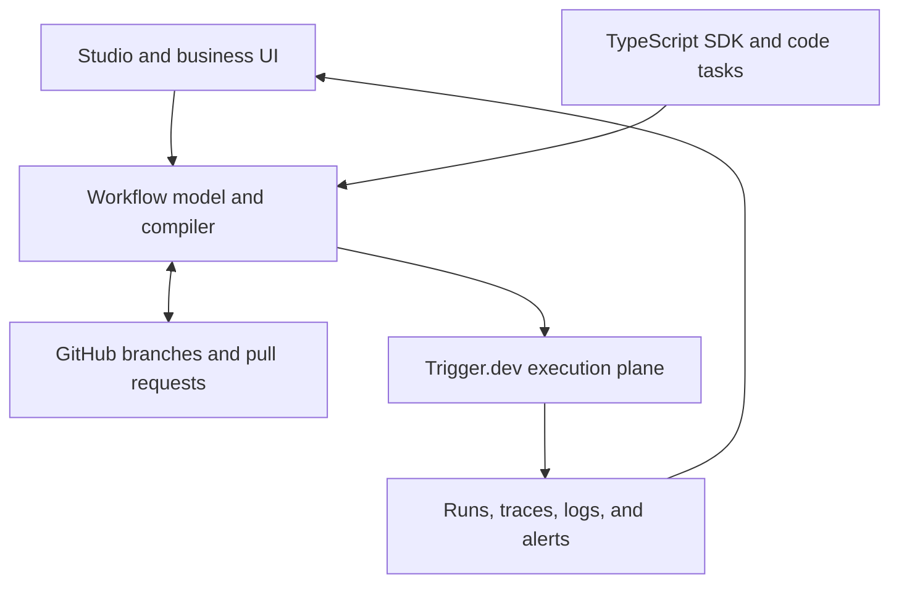

# Architecture

Flowcordia is split into planes so the visual product can evolve without destabilizing durable execution.

## Component boundaries

| Component | Owns | Must not own |
| --- | --- | --- |
| Studio | Canvas state, forms, visual diff, run visualization | Runtime scheduling or secret values |
| Workflow model | Portable graph, schemas, references, policy intent | Provider credentials or execution records |
| Compiler | Deterministic model-to-code output and diagnostics | Deployment promotion |
| GitHub adapter | Installation, repository, branch, commit, PR, checks | Workflow execution |
| Deployment adapter | Build request, version, promotion, preview mapping | Canvas editing |
| Trigger.dev runtime | Queues, retries, waits, workload execution, traces | Visual source of truth |
| Setup control | Presence checks, safe connection tests, guidance | Displaying or persisting raw secrets |

## Existing repository connections

- The web application lives under `apps/webapp`.
- Environment validation lives in `apps/webapp/app/env.server.ts`.
- General and alert email share `apps/webapp/app/services/email.server.ts`.
- Deployment creation enters through the existing deployment API and services.
- The run engine, supervisor, queue, and workload providers are inherited core systems.

Detailed evidence remains in `../research/`. Live connection status belongs in `../connections/README.md`.

