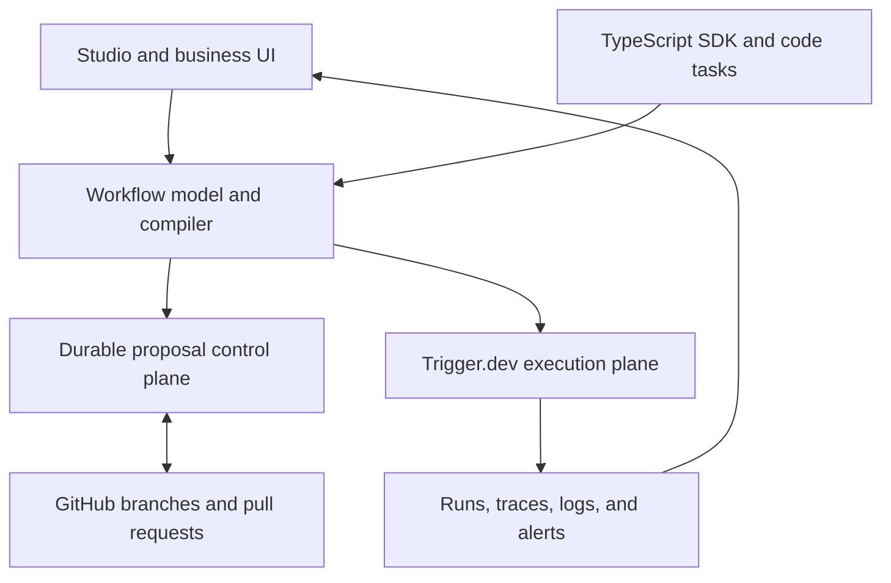

# Architecture

Flowcordia is split into planes so the visual product can evolve without destabilizing durable execution.

## Component boundaries

| Component | Owns | Must not own |
| --- | --- | --- |
| Studio | Canvas state, forms, visual diff, run visualization | Runtime scheduling or secret values |
| Workflow model | Portable graph, schemas, references, policy intent | Provider credentials or execution records |
| Compiler | Deterministic model-to-code output and diagnostics | Deployment promotion |
| GitHub adapter | Installation, repository, branch, commit, PR, checks | Workflow execution |
| Proposal control plane | Tenant-scoped proposal state, audit, outbox, webhook projection | GitHub credentials, visual drafts, runtime scheduling |
| Deployment adapter | Build request, version, promotion, preview mapping | Canvas editing |
| Trigger.dev runtime | Queues, retries, waits, workload execution, traces | Visual source of truth |
| Setup control | Presence checks, safe connection tests, guidance | Displaying or persisting raw secrets |

## Implemented contracts

- [`workflow-model.md`](./workflow-model.md) — portable model, validation, deterministic serialization, migrations, and stable identity.
- [`github-workflow-storage.md`](./github-workflow-storage.md) — installation-scoped Git reads/writes, concurrency, rate limits, audit receipts, and the webhook-fed index boundary.
- [`github-proposals.md`](./github-proposals.md) — resumable proposal branches and PRs, current-head review/check policy, expected-SHA promotion, and durable saga boundaries.
- [`proposal-control-plane.md`](./proposal-control-plane.md) — Prisma aggregate/audit/outbox persistence, tenant-safe API composition, verified webhook projection, and recovery boundaries.
- [`proposal-workspace.md`](./proposal-workspace.md) — feature-gated dashboard projection, browser redaction, exact-head actions, staged rollout, and runtime isolation.
- [`preview-deployment-live-runs.md`](./preview-deployment-live-runs.md) — native preview handoff, exact-head deployment identity, version-locked runs, browser redaction, and canvas projection.

## Existing repository connections

- The web application lives under `apps/webapp`.
- Environment validation lives in `apps/webapp/app/env.server.ts`.
- General and alert email share `apps/webapp/app/services/email.server.ts`.
- The webapp already owns the Octokit dependency and GitHub credential lifecycle used by adapters.
- Deployment creation enters through the existing deployment API and services.
- The run engine, supervisor, queue, and workload providers are inherited core systems.

Detailed evidence remains in `../research/`. Live connection status belongs in `../connections/README.md`.
