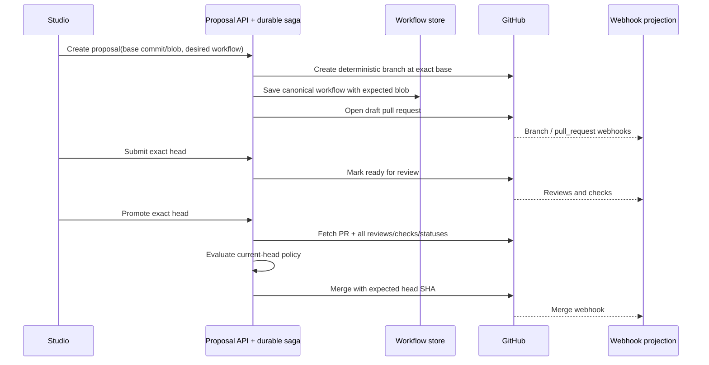

# Governed GitHub proposals

## Purpose

`@flowcordia/github-proposals` turns a validated visual workflow change into a native GitHub review without requiring a non-developer to understand branches, checks, review freshness, or merge races.

## Authority split

| Concern | Authority | Reason |
| --- | --- | --- |
| Workflow content/history | Git commit and blob | Human review, rollback, ownership, and immutable identity. |
| Proposal identity and operation state | Durable Flowcordia proposal aggregate | Tenant binding, saga recovery, audit, and UI lifecycle. |
| Branch, PR, reviews, checks, merge | GitHub | Native repository policy and organization governance. |
| Product blocker explanation | Pure Flowcordia policy evaluation over a fresh snapshot | Consistent UI and fail-closed API behavior. |
| Search/live proposal summaries | Webhook-fed projection | Low latency without polling every repository. |
| Runtime release | Reviewed source commit plus compiled deployment version | Connect governed intent to executable identity. |

The PR body marker aids recovery but grants no authority. The durable aggregate binds it to the authorized tenant/project/installation/repository and exact PR number.

## Lifecycle invariants

- Proposal IDs are caller-generated opaque identifiers and map to deterministic branches.
- Creation starts only if the base branch still equals the caller's base commit.
- Workflow writes retain expected-blob concurrency from the storage layer.
- A closed PR makes the proposal ID terminal; a new attempt uses a new ID.
- Submission and promotion require the exact expected head.
- Current-head approvals, pull-request-author and proposal-creator self-approval exclusion, required reviewers, and required checks are policy defaults or explicit inputs.
- Every collection used for policy is paginated.
- GitHub repository rules are always final; the application has no bypass path.
- Unknown mutation outcomes enter reconciliation, never blind retry.

## Enterprise integration boundary

The next webapp binding owns authorization, durable aggregate/outbox persistence, webhook ingestion, and API/UI projection. It passes authorized scope into this package and persists returned receipts. This package intentionally owns no database client, session, queue, or browser state, keeping the GitHub lifecycle portable and testable.
