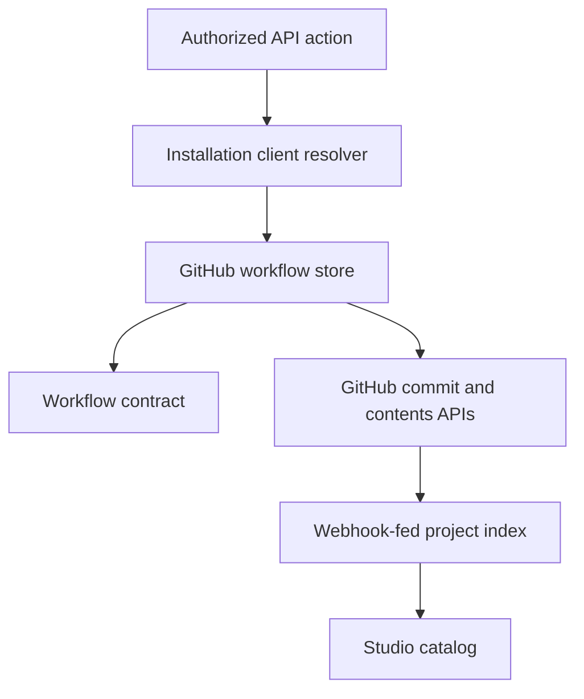

# GitHub workflow storage

## Purpose

`@flowcordia/github-workflows` connects the canonical workflow contract to installation-authorized GitHub repositories. It is a storage primitive for both direct draft branches and the later governed pull-request proposal layer.

## Source-of-truth split

| Data | Authority | Reason |
| --- | --- | --- |
| Workflow definition and change history | Git commit/blob | Review, rollback, ownership, and immutable release identity. |
| Workflow search/list summaries | Project database index | Low-latency enterprise discovery without GitHub scans. |
| Draft canvas interaction state | Collaboration store | High-frequency edits should not create Git commits. |
| Production release | Reviewed commit SHA plus runtime deployment version | Links governed intent to executable identity. |
| Secrets | Tenant/environment secret store | Values never belong in workflow files or Git history. |

The database index is rebuildable and never silently overrides Git content. Every indexed record carries repository, path, commit SHA, and blob SHA.

## Consistency and failure model

- A read resolves a requested revision, then reads the file at the returned commit SHA.
- A mutation preflights the branch and requires the caller's expected blob SHA.
- Changes to unrelated files do not block a workflow update; changes to the workflow blob do.
- Canonically identical content returns without a new commit.
- GitHub branch protections and installation permissions are authoritative.
- Read failures may be retried with bounded jitter against the same immutable commit.
- Mutation transport failures are treated as ambiguous until reconciled.
- Webhook/index consistency is asynchronous and observable; release compilation reads an exact Git source.

## Deliberate exclusions

This layer does not scan/list all workflows, persist drafts, merge concurrent canvas operations, open pull requests, approve releases, compile tasks, or deploy executions. Keeping those concerns separate prevents GitHub transport behavior from becoming the product domain model.
