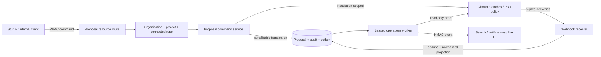

# Durable proposal control plane

## Purpose

The control plane turns the governed GitHub proposal port into a tenant-safe, recoverable product service. It is intentionally separate from Studio rendering and Trigger.dev execution: accepting a visual change, reviewing source, compiling an artifact, deploying a version, and running work are different authorities with different rollback and availability requirements.

## Authority matrix

| Concern | Authority |
| --- | --- |
| Session, organization/project membership, allowed action | Existing dashboard RBAC boundary |
| Repository/installation/production branch binding | Existing connected GitHub repository records |
| Flowcordia proposal identity and lifecycle | Durable proposal aggregate |
| Product audit and publication intent | Audit and transactional outbox tables |
| Branch, commit, PR, review, check, merge state | GitHub |
| Fast lifecycle projection | Verified webhook-derived aggregate fields |
| Runtime build/deploy/run | Later compiler and Trigger.dev execution adapters |

## Database model

`FlowcordiaWorkflowProposal` stores immutable tenant/repository/workflow/base identity, a SHA-256 of canonical desired workflow content, and the latest GitHub projection. `(repositoryId, proposalId)` and `(repositoryId, pullRequestNumber)` prevent adoption collisions. `version` provides compare-and-swap updates. `FlowcordiaProposalAuditEvent` is append-only and deduplicated. `FlowcordiaOutboxEvent` carries at-least-once publication leases. `FlowcordiaProposalReconciliation` keeps distributed scheduling and lock tokens outside the public aggregate. `FlowcordiaGithubWebhookDelivery` stores only normalized data and a raw-body SHA-256 hash.

The schema extends the existing organization, project, GitHub installation, and GitHub repository models. It does not duplicate credentials, installations, repository selection, branch tracking, users, or roles.

## Request sequence

1. Dashboard RBAC authenticates and authorizes a project-scoped GitHub action.
2. Server code resolves the existing connected repository and active installation.
3. Create reserves immutable identity and requested audit/outbox rows.
4. The GitHub adapter creates/resumes the deterministic branch, canonical workflow, and draft PR.
5. The returned receipt updates the aggregate and completion audit/outbox rows atomically.
6. Submit and promote repeat the requested-before-remote ordering and require the persisted expected head.
7. Promotion uses server-owned minimum policy and GitHub's expected-head merge.

## Event sequence

1. The receiver bounds the raw body and verifies the GitHub App HMAC.
2. Supported payloads are normalized to installation/repository/PR/head fields.
3. A delivery ID and payload hash reserve replay identity.
4. Exact branch/base matches may advance the cached projection; stale events cannot regress it.
5. The delivery, projection, audit, and outbox writes commit together.

The projection improves UI latency. It is never used as proof that promotion is safe; the proposal service reads GitHub immediately before policy evaluation and merge.

## Deliberate next boundaries

- The feature-gated proposal workspace now consumes a redacted list projection and acknowledgement-only command resource; visual graph editing remains separate.
- Organization-owned proposal policy will strengthen the current fail-closed server defaults.
- Compiler/deployment linkage will bind a merged source commit to an immutable Trigger.dev version.
