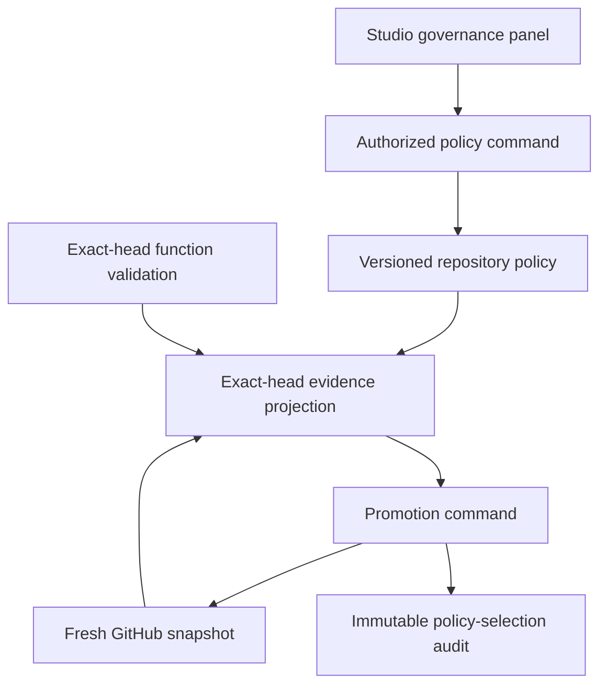

# Proposal governance architecture

## Purpose

Proposal governance turns repository policy into durable, explainable control-plane state without replacing GitHub repository rules. Studio can explain what is required and why promotion is blocked, while the server remains the only promotion authority.

## Ownership

| Component | Owns | Why it is separate |
| --- | --- | --- |
| `@flowcordia/github-proposals/src/policy` | Strict profile parsing, canonical digest, immutable enterprise floor, monotonic-strengthening comparison, and pure GitHub evaluation | Policy remains portable and testable without webapp, database, or credentials. |
| `proposals/governance/repository.server.ts` | Repository-scoped policy persistence, optimistic concurrency, integrity checks, and audit writes | Raw durable state stays behind an authenticated server boundary. |
| `proposals/governance/service.server.ts` | Default materialization and effective-policy resolution | Callers receive one policy contract whether or not a repository has saved an override. |
| `proposals/governance/presentation.ts` | Browser-safe policy and exact-head evidence | Studio receives bounded explanations, never internal scope or credentials. |
| `ProposalGovernancePanel.tsx` | Policy editor and human-readable evidence | The UI guides users but cannot grant promotion authority. |
| Shared proposal command | Validation gate, exact policy selection, audit correlation, and promotion | Every internal and Studio promotion path uses the same enforcement. |

## Repository policy identity

The durable identity is the authorized project plus connected repository database identity. GitHub owner, repository name, and tracked branch are mutable coordinate snapshots; they are refreshed on a successful write but are not used to make an existing policy disappear after a rename or default-branch change.

Each stored policy has:

- an opaque public UUID;
- a monotonically increasing version;
- a SHA-256 digest of the normalized profile;
- actor and timestamp attribution;
- repository and installation scope proof;
- a corresponding audit event.

Reads recompute the digest and fail closed if persisted JSON, schema version, or digest is inconsistent.

## Policy layers

The repository profile may set minimum approvals, required check names, required reviewer IDs, and an optional allowed-reviewer set. Application code adds an immutable floor:

- approvals apply to the exact current head;
- pull-request author and proposal creator self-approval do not count;
- a current changes-requested review blocks promotion.

An ordinary GitHub-write actor may create the initial valid repository profile. Later writes must be component-wise strengthening: approvals cannot decrease, required checks or reviewers cannot be removed, and an allowed-reviewer constraint cannot be removed or expanded. A future privileged relaxation workflow must be a separate, explicitly authorized, separately audited surface; this command is intentionally not that workflow.

## Evidence and promotion

The workspace loader evaluates the selected durable proposal, not merely the first proposal on the page. GitHub evidence and function validation are loaded independently so one outage does not erase the other source's status.

Evidence states have operational meaning:

| State | Meaning |
| --- | --- |
| `SATISFIED` | GitHub evidence and repository function validation currently pass for the exact head. |
| `PENDING` | Only recoverable in-flight evidence remains, such as checks, mergeability, or function validation. |
| `BLOCKED` | At least one known durable blocker exists. |
| `UNAVAILABLE` | Required evidence cannot currently be read and no known blocker supersedes that outage. |
| `NOT_APPLICABLE` | No published exact proposal head exists. |

This projection only controls UI guidance. Promotion re-resolves authorization, proposal identity, exact-head function validation, the current policy row, and fresh GitHub state. The selected policy version and digest are audited before the proposal service evaluates GitHub. An update that wins before policy selection invalidates the attempt. Once selection is audited, that immutable snapshot governs the in-flight attempt; later monotonic strengthening applies to subsequent attempts and remains separately auditable.

## Idempotency and failure behavior

- Policy writes use expected version and a row lock.
- Promotion-policy selection uses proposal, head, digest, and request correlation in its dedupe key.
- A retry with the exact same identity returns the existing audit proof; a conflicting payload fails closed.
- Derived correlation IDs are deterministically bounded to the database limit.
- GitHub, validation, persistence, and policy integrity failures never downgrade into permission to merge.
- GitHub pull-request matches, reviews, check runs, and commit statuses are read with explicit item
  bounds. Evidence overflow fails closed instead of evaluating a truncated snapshot.
- GitHub repository rules remain final authority and may reject a merge after Flowcordia policy passes.
