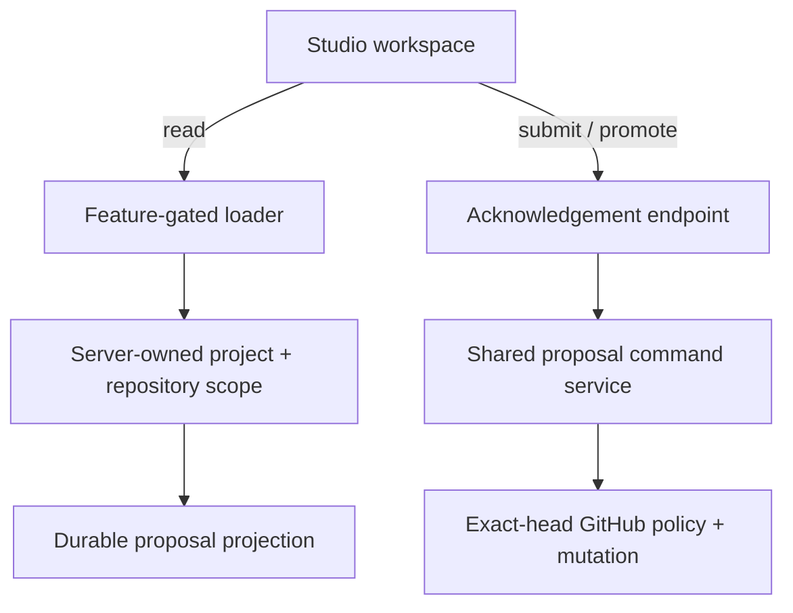

# Proposal workspace architecture

## Purpose

The proposal workspace closes the first product-facing gap between the durable Flowcordia control plane and normal dashboard users. It makes GitHub proposal state understandable and actionable without moving GitHub credentials, internal scope, deployment authority, or runtime execution into the browser.

## Authority and data boundaries

| Concern | Authority | Browser visibility |
| --- | --- | --- |
| Session and project access | Existing dashboard RBAC | Allowed/denied only |
| Studio rollout | Organization override, global feature flag, environment default | Resolved boolean only |
| Organization/project/repository/installation binding | Existing database records resolved on the server | Repository owner, name, and production branch only |
| Proposal lifecycle | Durable control-plane aggregate | Public proposal/workflow/Git/PR state only |
| Submit and promotion eligibility | Durable state plus observed head | One available action or none |
| Review, check, branch protection, and merge proof | Fresh GitHub read in the proposal service | Success or bounded failure explanation |
| Deployment and execution | Trigger.dev deployment/runtime planes | Unchanged and not connected in this slice |

The browser DTO deliberately excludes storage ID, tenant ID, project ID, installation ID, repository database/GitHub IDs, creator/reviewer identity, user ID, correlation ID, optimistic-concurrency version, expected blob SHA, and raw provider error text. Successful Studio commands return only an acknowledgement and force loader revalidation.

## State and action contract

| Durable state | Workspace meaning | Browser action |
| --- | --- | --- |
| `CREATING` / `PROMOTING` | A remote mutation is in progress | None |
| `DRAFT` with observed head | Proposal can enter governed review | Submit exact head |
| `READY` with observed head | Proposal can be checked for promotion | Confirm merge method, then promote exact head |
| `RECONCILING` | GitHub outcome or identity is not proven | None; refresh after reconciliation |
| `FAILED` | Operator attention is required | None |
| `MERGED` / `CLOSED` | Terminal projection | None |

UI availability is guidance, not enforcement. The write resource re-authenticates, re-derives scope, and calls the same server command service used by the internal API. GitHub approvals, checks, branch protection, and expected head are evaluated again during promotion.

## Scale and failure behavior

- Queries are repository-scoped and use a 50-row keyset page. The browser carries `(updatedAt, proposalId)` and the server resolves the internal storage anchor only inside the authorized repository scope.
- Header counts describe the visible page, avoiding an unbounded aggregate query.
- Filters reset the cursor so state changes cannot mix incompatible pages.
- Missing or invalid repository configuration renders a safe connection state; it does not alter runtime behavior.
- Disabled Studio routes return not found and navigation is omitted.
- Stale heads, policy blockers, rate limits, and ambiguous mutations remain control-plane failures; the UI never retries mutations automatically.
- Reconciliation and outbox delivery remain owned by the independently gated proposal operations worker from the preceding stack layer.

## Isolation proof

This slice adds dashboard routes, a presenter/query boundary, feature-flag wiring, and documentation. It does not change a database schema, webhook contract, GitHub mutation algorithm, worker schedule, deployment API, run-engine queue, supervisor, CLI, or customer workload path. Disabling the Studio flag removes the surface without stopping the existing internal proposal API or operations worker.
