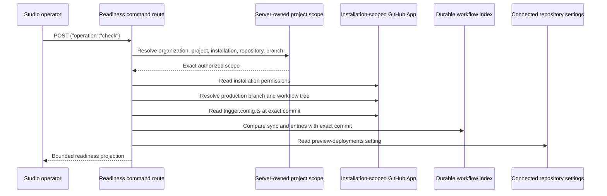

# Connected repository readiness

## Purpose

Flowcordia cannot claim a connected canvas-to-runtime path when the GitHub App, repository branch,
workflow index, Trigger.dev task discovery, or preview setting is unknown. The repository-readiness
probe converts those hidden prerequisites into one explicit, read-only operator check.

## Flow

## Readiness rule

`READY` requires every check to pass. An operator-actionable configuration or permission gap is
`BLOCKED`. A transient provider, transport, or invalid-response condition is `UNAVAILABLE`. Neither
state can be represented as successful evidence.

The check is intentionally manual. Studio does not add installation and repository-tree reads to
every loader refresh.

## Task discovery

Generated tasks live under `trigger/flowcordia`. A standard Trigger.dev configuration passes through
default discovery. When `dirs` is explicitly declared, the probe accepts only a static string array
that includes `trigger` or `trigger/flowcordia`. Dynamic or ambiguous configuration fails closed
because a source scan cannot prove runtime discovery.

## Non-goals

This slice does not:

- mutate GitHub;
- prepare a preview environment;
- trigger a build or run;
- prove repository code execution;
- replace the rollout runbook;
- expose provider or persistence identity to the browser.
